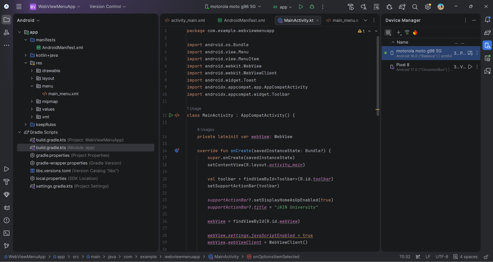
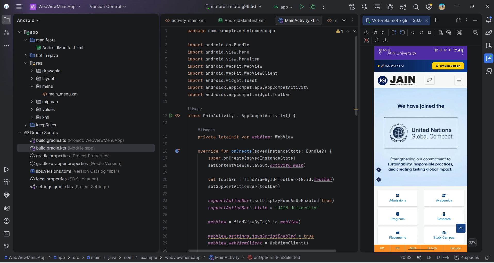
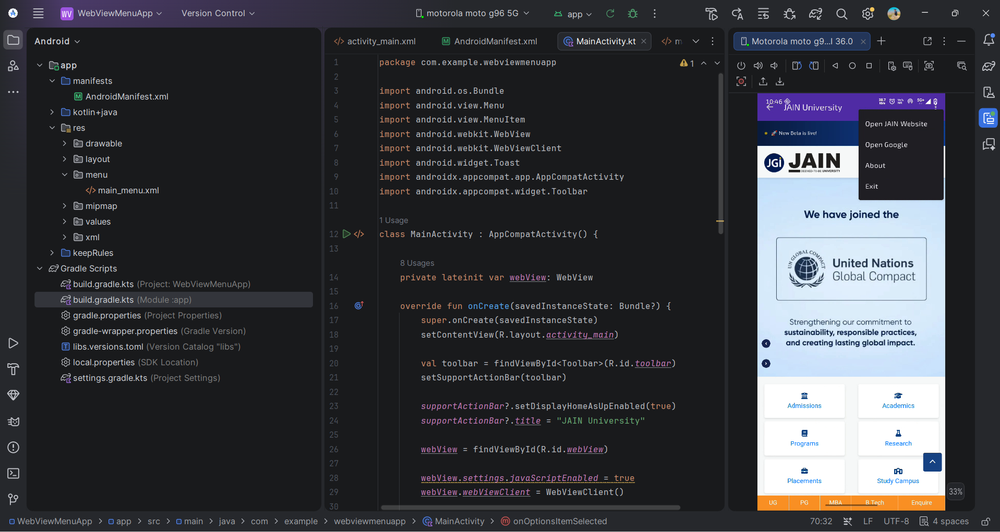
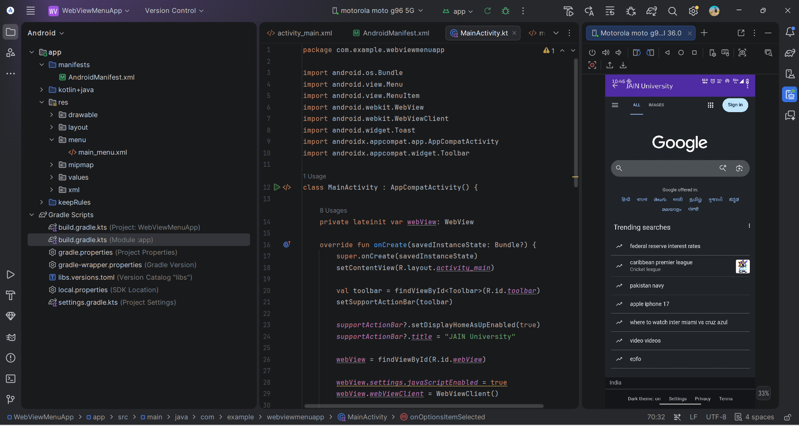

# MAD Experiment 8 – WebView and Menu

## Experiment Details

**Experiment No.:** 8  
**Title:** Implementing Menus and WebView in an Android Application  
**Language:** Kotlin  
**Platform:** Android Studio  
**UI:** XML  

## Aim

To develop an Android application that demonstrates the use of Options Menu and WebView for displaying web pages inside an Android application.

## Requirements

- Android Studio
- Kotlin
- Android SDK
- Android Emulator / Physical Android Device
- Internet Connection

## Concept / Technology

**WebView:** WebView is used to display web pages directly inside an Android application.

**Options Menu:** Options Menu provides actions such as opening the JAIN University website, opening Google, displaying About information, and exiting the application.

**WebViewClient:** WebViewClient allows web pages to open inside the application's WebView instead of an external browser.

## Scenario

A university application provides quick access to the JAIN University website and Google without leaving the application. WebView is used to display web pages, while the Options Menu provides different actions.

## Features

- JAIN University website using WebView
- Google using WebView
- Options Menu
- Open JAIN Website
- Open Google
- About option
- Exit option
- Toolbar
- Toast messages

## Procedure

1. Create an Android Studio project using Empty Views Activity.
2. Create the XML layout containing Toolbar and WebView.
3. Add Internet permission in `AndroidManifest.xml`.
4. Create `main_menu.xml`.
5. Initialize WebView in `MainActivity.kt`.
6. Enable JavaScript and configure WebViewClient.
7. Load the JAIN University website.
8. Implement the Options Menu.
9. Implement Google WebView.
10. Run and test the application.

## Project Structure

```text
WebViewMenuApp/
│
├── app/
│   └── src/main/
│       ├── java/com/example/webviewmenuapp/
│       │   └── MainActivity.kt
│       │
│       ├── res/
│       │   ├── drawable/
│       │   ├── layout/
│       │   │   └── activity_main.xml
│       │   ├── menu/
│       │   │   └── main_menu.xml
│       │   ├── mipmap/
│       │   ├── values/
│       │   └── xml/
│       │
│       └── AndroidManifest.xml
│
├── Screenshots/
│   ├── 01_Android_Studio_MainActivity.png
│   ├── 02_JAIN_University_WebView.png
│   ├── 03_Options_Menu.png
│   └── 04_Google_WebView.png
│
├── build.gradle.kts
├── gradle.properties
├── gradlew
├── gradlew.bat
├── settings.gradle.kts
└── README.md
```

## Test Cases

### Test Case 1 – JAIN University WebView

**Input:** Launch the application.

**Expected Output:** JAIN University website opens inside WebView.

**Status:** PASS

### Test Case 2 – Options Menu

**Input:** Click the Options Menu.

**Expected Output:** Open JAIN Website, Open Google, About and Exit options are displayed.

**Status:** PASS

### Test Case 3 – Google WebView

**Input:** Select Open Google from the Options Menu.

**Expected Output:** Google opens inside WebView.

**Status:** PASS

## Student Details

**Name:** Md Atiullah Ansari  
**USN:** 25MCAR0108  

## Application Screenshots

### 1. Android Studio – MainActivity



### 2. JAIN University WebView



### 3. Options Menu



### 4. Google WebView



## Expected Output

The application successfully displays the JAIN University website and Google inside WebView. The Options Menu provides options to open websites, display About information, and exit the application.

## Result

The Android application successfully demonstrates **Menus and WebView using Kotlin**.

## Technologies Used

- Kotlin
- Android Studio
- XML
- Android SDK
- WebView
- WebViewClient
- Options Menu
- Toolbar

## Learning Outcome

- Understanding WebView in Android
- Loading web pages inside an application
- Using WebViewClient
- Creating and handling Options Menu
- Using Toolbar
- Handling menu item clicks
- Displaying Toast messages

## GitHub Repository

[View the GitHub Repository](https://github.com/Atiullah18/MAD-Experiment-8-WebView-Menu)
